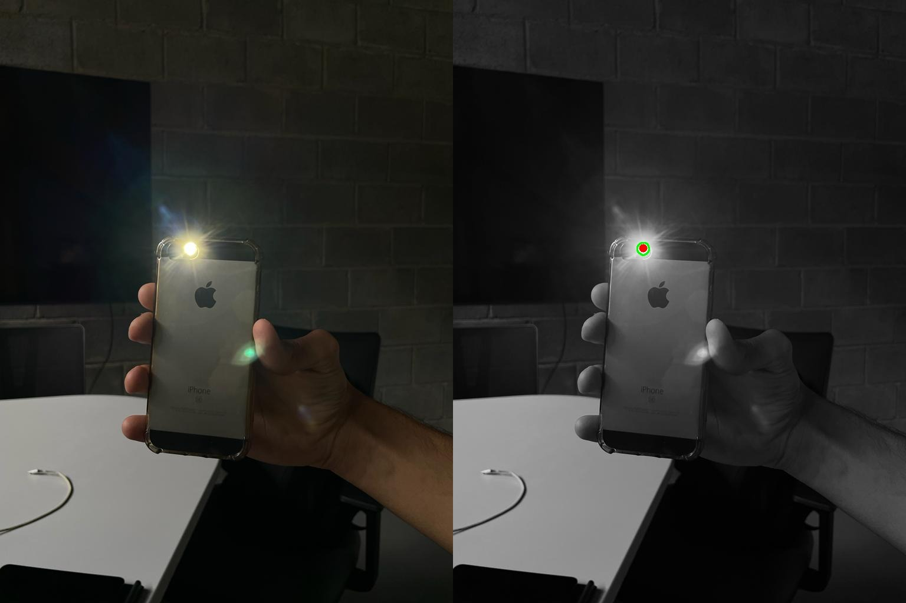

# About the repo 

*Created on 2022.1* | CubeSats are a particular type of nanosatellite with sharp growth in the last few years. Aiming to take part in this expansion, PoliSat, a team composed of engineering students, was founded. The first step of the team was to develop a basic CubeSat for didactic purposes. It had only 1 rotation DoF and will enable the team to get hands-on in the project.

Each subsystem had a main goal and for the Attitude Determination Control System (ADCS) the mission was to create a control system that follows one light source, simulating the sun. To do so, it was necessary to first create an algorithm that detects the light by computer vision.

With no previous experience, I took the challenge to create a Python code that could be later implemented in the control system. This code is available in this repo and the output obtained can be seen in the figure below: 

